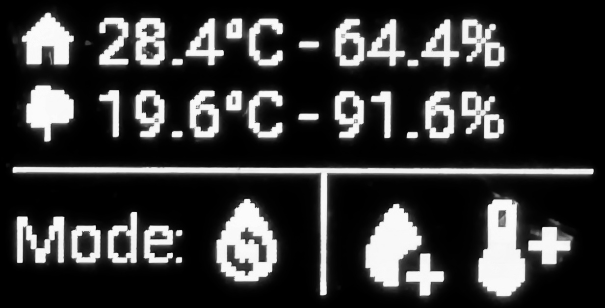
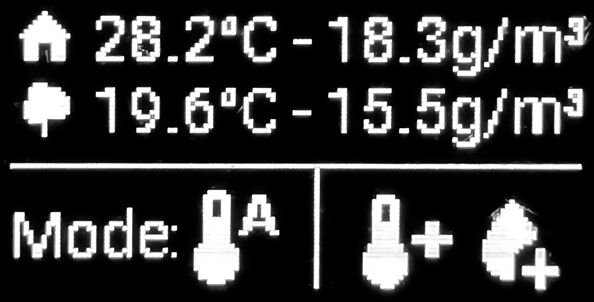
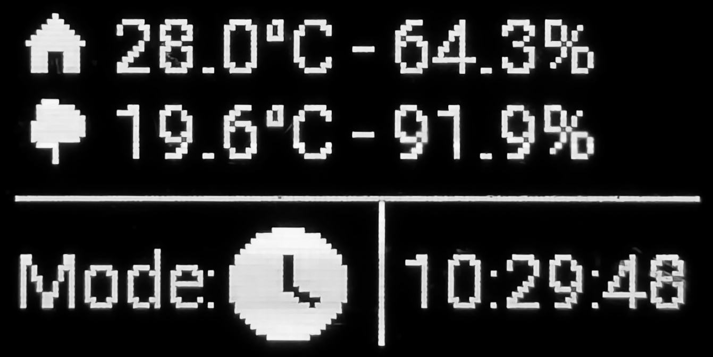
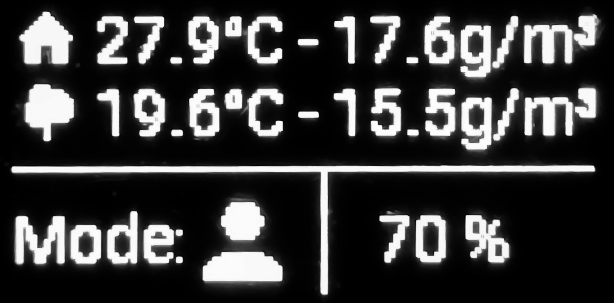
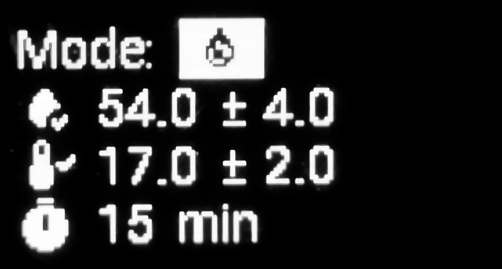
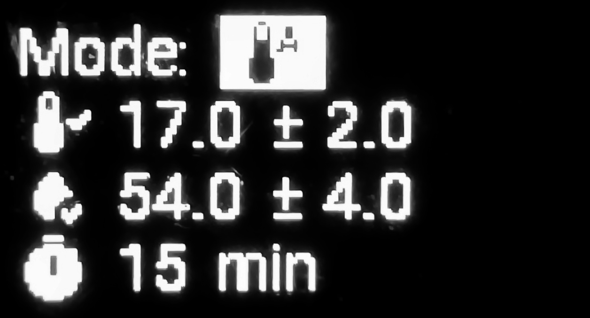
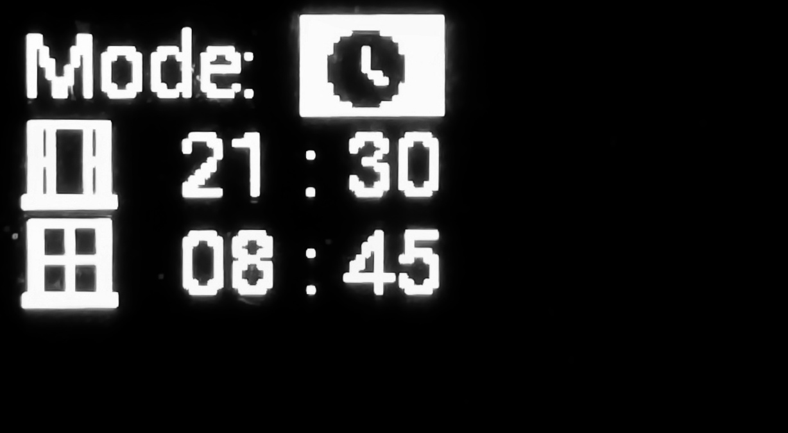
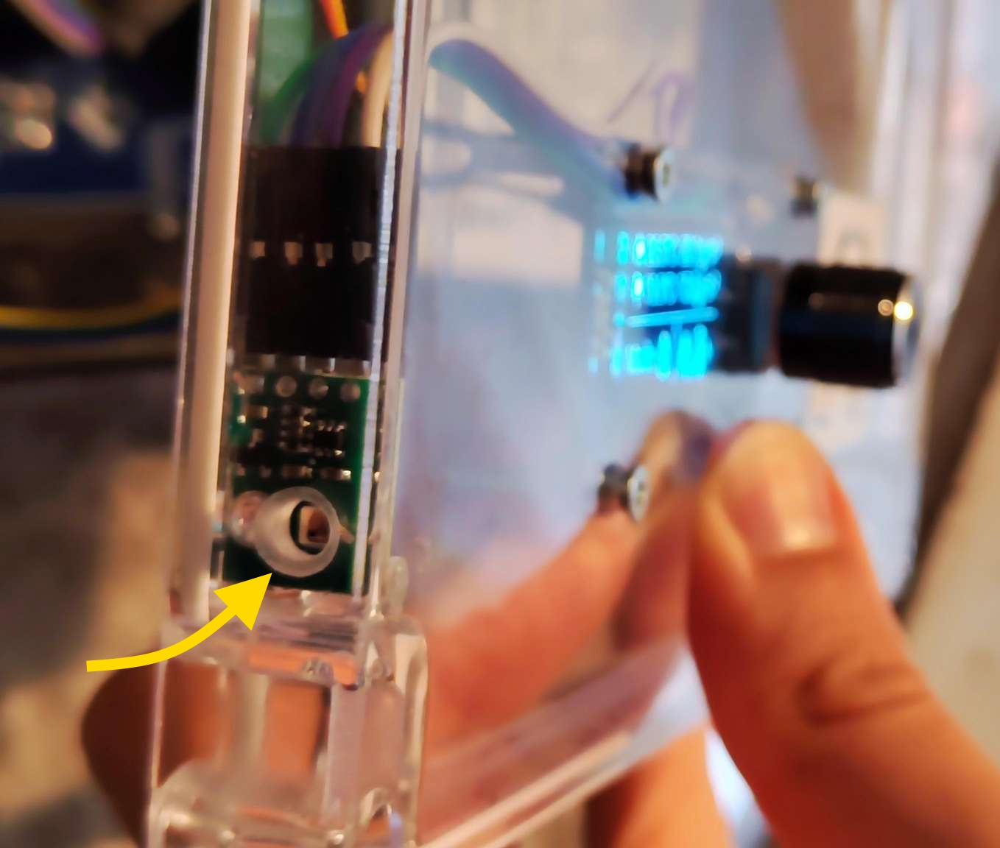
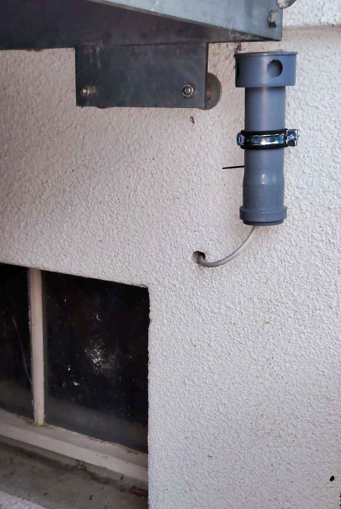
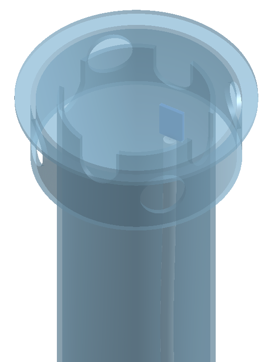

# Automated Window Controller (based on ESPHome)

## ✨ Features

- 🪟 Automatically controls a motorized window based on indoor and outdoor climate conditions.
- Uses separate indoor 🏠 and outdoor 🌳 sensors for temperature 🌡️ and humidity 💧.
- 🧮 Calculates absolute humidity to determine whether ventilation actually helps to remove moisture from the room.
- 📋 Supported operating modes: **Humidity**, **Temperature**, **Scheduled**, and **Manual**.
- 📟 Displays the current measurement values, operating mode and evaluation directly on the display.
- ⚙️ Configurable target values and hysteresis for both temperature and humidity.
- 🔒 Local control and configuration using a rotary encoder and OLED display.
- 🚫 Standalone operation and configuration, without any Wi-Fi connection supported.
- 🌈 Can be fully integrated into Home Assistant through ESPHome.

## 🔀 Operating Modes

### 💧 Humidity Mode

This mode prioritizes to **control the indoor humidity**. Whenever the measured indoor humidity is above/below the configured target humidity, the firmware will perform several checks, to regulate the humidity + temperature (works similar for case: _Humidity too low?_  ):


<details>
   <summary>* Open here to see Outside Temperature decision</summary>

   ```mermaid
   flowchart LR
   subgraph Outside Temperature OK?
       direction LR
       AA(Inside temperature too high)
       BB[Outside hotter?]
       CC(Inside temperature too low)
       DD[Outside colder?]
       XX([OK])
       YY([not OK])
       AA --> BB -->|"Yes"| YY
       BB -->|"No (equal or lower)"| XX
       CC --> DD -->|"Yes"| YY
       DD -->|"No (equal or hotter)"| XX
   end
   ```
</details>

⭐ perfect mode to **combine e.g. with a radiator**


### 🌡️ Temperature Mode

This mode prioritizes to **control the indoor temperature**. Decision tree is similar to the humidity mode:


\* the _Outside Humidity OK?_ decision is analogue to the _Outside Temperature decision_ documented above.  
⭐ perfect mode to **combine with an air dryer**

### ⏱️ Scheduled Mode

Scheduled Mode opens and closes the window according to configurable times.  
⭐ perfect mode if you prefer more **predictable open/close times**

### ⏸️ Manual Mode

Manual Mode gives the user direct control over the window position. The rotary encoder can be used to set the desired window position in 10 % steps.  
⭐ perfect mode to **let Home Assistant decide with more complex automation**

---

## 🕹️ Local User Interface

The controller can be operated and configured directly on the device using a rotary encoder with an integrated push button and an OLED display. This allows a **standalone operation and configuration**. If the device is integrated into Home Assistant the settings are also accessible from there, along with the actual sensor values.

### 📟 Status Screen

The default screen provides an overview of the current operating state of the controller.

| Humidity Mode (relative humidity shown) | Temperature Mode (absolute humidity shown) |
| --------------------------------------- | ------------------------------------------ |
|  |  |
| The bottom right field shows, weather the humidity and temperature is too high ➕, too low ➖ or within the range ✔️. | The bottom right fiend shows, weather the temperature and humidity is too high ➕, too low ➖ or within the range ✔️. |
|  |  |


| Scheduled Mode | Manual Mode |
| -------------- | ----------- |
|  |  |
| The bottom right field shows an countdown, for the next operation (open/close). | The bottom right field shows the opening percentage of the window. |
|  |  |

> [!TIP]  
> After a period of inactivity, the display is turned off automatically to prevent burn-in.

### 🕛 Rotary Encoder Controls

The rotary encoder is used to:
- manually open and close the window
- navigate through the user interface, to adjust the configuration values

[](https://youtu.be/pyNii1Dii28)  
Click on the thumbnail to watch the demo-video.

<details>
   <summary>Open here to see all settings pages</summary>

   | Humidity Mode (relative humidity shown) | Temperature Mode (absolute humidity shown) |
   | --------------------------------------- | ------------------------------------------ |
   |  |  |

   | Scheduled Mode | Manual Mode |
   | -------------- | ----------- |
   |  |  |

   > [!TIP]  
   > Rotate the encoder to change the settings. Push the encoder to switch to the next option.

</details>
<br>

### ⚙️ Settings

The available settings are **based on the selected operation mode**:

| Option                                | Modes                  | Default Values |
| ------------------------------------- | ---------------------- | -------------- |
| Target indoor humidity                | Humidity + Temperature | 54.0 %         |
| Humidity hysteresis                   | Humidity + Temperature | ± 4.0 %        |
| Target indoor temperature             | Humidity + Temperature | 17.0 °C        |
| Temperature hysteresis                | Humidity + Temperature | ± 2.0 °C       |
| Minimum time between window movements | Humidity + Temperature | 10 min         |
| Open Time                             | Scheduled              | 20:00          |
| Close Time                            | Scheduled              | 08:00          |

In **Manual Mode**, the desired window position can be adjusted in 10 % steps by rotating the encoder.

---

## 🧰 Hardware

### 🧩 Parts List

| Qty. | Name | Comment |
| ---- | ---- | ------- |
| 1x   | **[ESP32 Relay Development Board](https://de.aliexpress.com/item/1005006043068591.html)** <br> with AC/DC Power Supply | 2-channel board would also be sufficient |
| 2x   | **[AHT20 Digital Temperature and Humidity Sensor](https://de.aliexpress.com/item/1005007130351017.html)** | or any other similar sensor | 
| 1x   | **[1.3 inch OLED display screen](https://de.aliexpress.com/item/1005007637179206.html)** <br> combined with EC11 rotary encoder module | also works without the encoder. Then, configuration is done from the HomeAssistant UI |
| 1x   | **[Electric Motor / Chain Actuator 230V](https://www.ebay.com/itm/354574195507)** | or any other suitable drive |
| some | Jumper wires | |
| 1x   | [Project-Box](https://www.amazon.de/dp/B0GH1KQSCP?th=1) measuring > 95x95mm on the inside  |  |
| 1x   | [UART-TTL USB Adapter](https://www.amazon.de/dp/B0DBHM62GM) <br> with 5V power supply | Required for first flash. <br> _The board does not have an USB-port!_ |

 > [!NOTE]  
 > Feel free to swap components. But keep in mind, that some code blocks might require an update and depending on the communication between the components also different GPIOs must be used.


### 📍Pinout

| Component                   | ESP32 GPIO | Note                   |
| --------------------------- | ---------- | ---------------------- |
| Rotary encoder A            | GPIO16     |                        |
| Rotary encoder B            | GPIO17     |                        |
| Rotary encoder push button  | GPIO5      |                        |
| Indoor AHT20 + OLED display | GPIO19     | I²C (inside) SCL       |
| Indoor AHT20 + OLED display | GPIO21     | I²C (inside) SDA       |
| Outdoor AHT20               | GPIO22     | I²C (outside) SCL      |
| Outdoor AHT20               | GPIO23     | I²C (outside) SDA      |
| Relay – Close window        | GPIO25/32  | Depending on the board |
| Relay – Open window         | GPIO26/33  | Depending on the board |

> The indoor/outdoor AHT20 sensor using a separate I²C bus, allowing both sensors to operate independently despite using the same I²C address (0x38).  
> The GPIOs for the relays are depending on the board.


### 🔌Wiring

> [!CAUTION]  
> Do not work on 230V applications, unless you are a qualified electrician.


---

## 🛠️ Installation

### 📥 ESPHome Installation

Prerequisites: [Install ESPHome](https://esphome.io/install/)

1. Download the `device.yaml` from this repository.

2. Adjust the configuration to match your environment, especially:
   - All substitutions on the to of the yaml-file.
   - Wi-Fi credentials + Hotspot Password
   - API encryption key
   - OTA password
   - Rename the _friendly_names_ to match your need

3. Connect the ESP32 to your computer via an _UART-TTL USB Adapter_ and install the firmware.
    <details>
       <summary>See diagram for connection details</summary>
       
    </details>
   
   [See official documentation for command line syntax and other options](https://esphome.io/install/getting-started/#updating-your-device)

4. After the initial installation, further updates can be installed over the air.

5. The device can be discovered in Home Assistant through the ESPHome integration. Adding your edited yaml to the ESPHome Addon (if used) would be advisable, as it enables automatic ESPHome updates.


### 🪛 Mechanical Installation

Mount the window actuator according to its official documentation. If the the direction of the motor is wrong, swap the GPIO-Pins or ID of  `relay_open` and `relay_close`. You may adjust the `open_duration` and `close_duration`, but assign the `close_duration` +2sec for proper closing.

> [!WARNING]  
> Make sure that the window can move freely and that no persons or objects can be trapped by the actuator.

<details>
   <summary>Here you can see, how I assembled the sensors:</summary>
   

   
   
</details>
<br>
