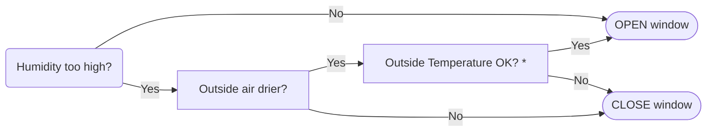
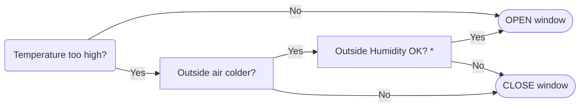

# Automated Window Controller (based on ESPHome)

## ✨ Features

- 🪟 Automatically controls a motorized window based on indoor and outdoor climate conditions.
- Uses separate indoor 🏠 and outdoor 🌳 sensors for temperature 🌡️ and humidity 💧.
- 🧮 Calculates absolute humidity to determine whether ventilation actually helps to remove moisture from the room.
- 📋 Supported operating modes: **Humidity**, **Temperature**, **Scheduled**, and **Manual**.
- 📟 Displays the current measurement values, operating mode and evaluation directly on the display.
- ⚙️ Configurable target values and hysteresis for both temperature and humidity.
- 🔒 Local control and configuration using a rotary encoder and OLED display.
- 🚫 Standalone operation and configuration, without any Wi-Fi connection supported.
- 🌈 Can be fully integrated into Home Assistant through ESPHome.

## 🔀 Operating Modes

### 💧 Humidity Mode

This mode prioritizes to **control the indoor humidity**. Whenever the measured indoor humidity is above/below the configured target humidity, the firmware will perform several checks, to regulate the humidity + temperature (works similar for case: _Humidity too low?_  ):


<details>
   <summary>* Open here to see Outside Temperature decision</summary>

   ```mermaid
   flowchart LR
   subgraph Outside Temperature OK?
       direction LR
       AA(Inside temperature too high)
       BB[Outside hotter?]
       CC(Inside temperature too low)
       DD[Outside colder?]
       XX([OK])
       YY([not OK])
       AA --> BB -->|"Yes"| YY
       BB -->|"No (equal or lower)"| XX
       CC --> DD -->|"Yes"| YY
       DD -->|"No (equal or hotter)"| XX
   end
   ```
</details>
<br>

⭐ perfect mode to **combine e.g. with a radiator**

<br>

### 🌡️ Temperature Mode

This mode prioritizes to **control the indoor temperature**. Decision tree is similar to the humidity mode:


▶ * the _Outside Humidity OK?_ decision is analogue to the _Outside Temperature decision_ documented above.

⭐ perfect mode to **combine with an air dryer**

### ⏱️ Scheduled Mode

Scheduled Mode opens and closes the window according to configurable times.

⭐ perfect mode if you prefer more **predictable open/close times**

### ⏸️ Manual Mode

Manual Mode gives the user direct control over the window position. The rotary encoder can be used to set the desired window position in 10 % steps.

⭐ perfect mode to **let Home Assistant decide with more complex automation**

---

## 🧰 Hardware

### 🧩 Parts List

| Qty. | Name | Comment |
| ---- | ---- | ------- |
| 1x   | **[ESP32 Relay Development Board](https://de.aliexpress.com/item/1005006043068591.html)** <br> with AC/DC Power Supply | 2-channel board would also be sufficient |
| 2x   | **[AHT20 Digital Temperature and Humidity Sensor](https://de.aliexpress.com/item/1005007130351017.html)** | or any other similar sensor | 
| 1x   | **[1.3 inch OLED display screen](https://de.aliexpress.com/item/1005007637179206.html)** <br> combined with EC11 rotary encoder module | also works without the encoder. Then, configuration is done from the HomeAssistant UI |
| 1x   | **[Electric Motor / Chain Actuator 230V](https://www.ebay.com/itm/354574195507)** | or any other suitable drive |
| some | Jumper wires | |
| 1x   | [Project-Box](https://www.amazon.de/dp/B0GH1KQSCP?th=1) measuring > 95x95mm on the inside  |  |
| 1x   | [UART-TTL USB Adapter](https://www.amazon.de/dp/B0DBHM62GM) <br> with 5V power supply | Required for first flash. <br> _The board does not have an USB-port!_ |

 > [!NOTE]  
 > Feel free to swap components. But keep in mind, that some code blocks might require an update and depending on the communication between the components also different GPIOs must be used.


